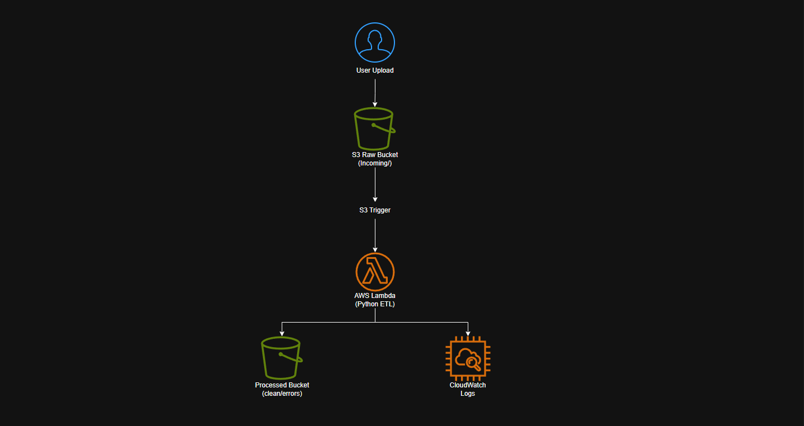
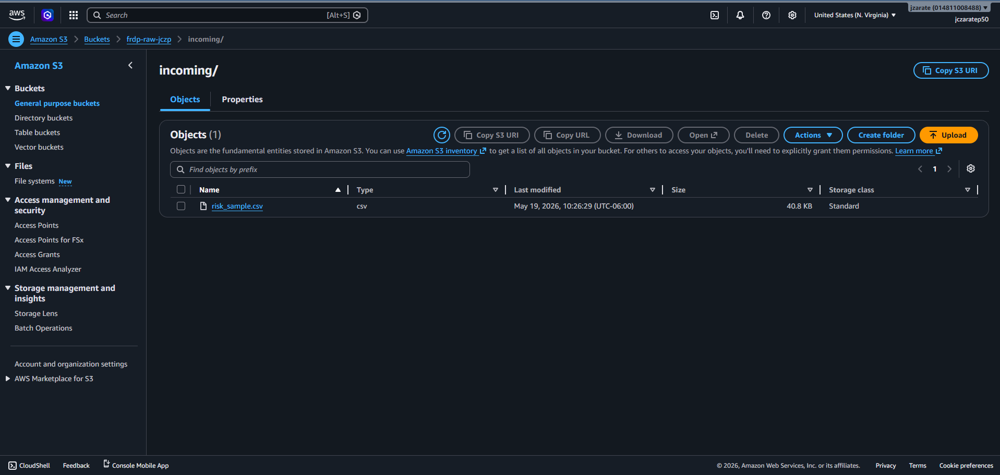
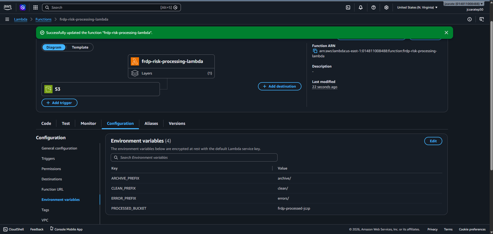
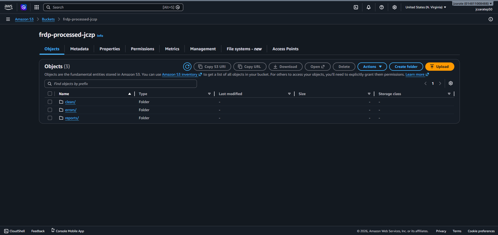
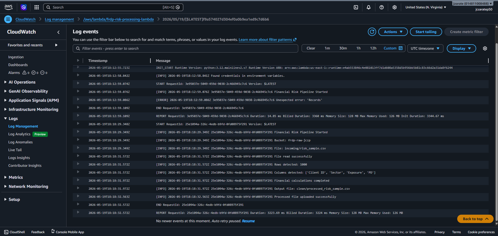

# Financial Risk Data Pipeline on AWS

## Project Overview
This project is a serverless financial risk ETL pipeline built on AWS. The pipeline automatically processes financial risk datasets uploaded to Amazon S3, validates the schema, performs risk calculations using Python and pandas, and stores processed outputs in a separate S3 bucket.

Main objectives:
- Build a practical AWS serverless pipeline
- Automate financial data processing workflows
- Implement event-driven architecture
- Practice cloud observability and error handling
- Create a portfolio-ready cloud/data engineering project

## Architecture

## AWS Services Used

- Amazon S3
  - Raw data ingestion
  - Processed data storage
  - Archive and error management

- AWS Lambda
  - Serverless ETL processing
  - Automated event-driven execution

- AWS IAM
  - Secure access management between AWS services

- Amazon CloudWatch
  - Logging and monitoring

- Python (pandas / numpy)
  - Data transformation and financial risk calculations
 
## ETL Workflow

1. A CSV file is uploaded to the `incoming/` folder in the raw S3 bucket.

2. Amazon S3 automatically triggers the AWS Lambda function.

3. The Lambda function:
   - Reads the CSV file
   - Validates required columns
   - Processes financial risk calculations
   - Generates risk classifications
4. Processed files are stored in the processed S3 bucket under `clean/`.
5. Successfully processed source files are moved to `archive/`.
6. Invalid files are moved to `errors/`.

7. Execution logs are stored in Amazon CloudWatch.

## Financial Risk Calculations

The pipeline calculates Expected Loss (EL) using the following formula:

EL = Exposure × PD

Where:
- Exposure = Financial exposure amount
- PD = Probability of Default

Risk classification rules:
- LOW → EL < 1000
- MEDIUM → 1000 ≤ EL ≤ 5000
- HIGH → EL > 5000

## Error Handling

The pipeline validates required columns before processing files.

If validation fails:
- The file is moved to the `errors/` folder
- Processing is interrupted
- Error details are logged in CloudWatch

This prevents invalid datasets from entering downstream processing stages.

## Cost Optimization

The project was designed with low operational cost in mind:

- Serverless architecture using AWS Lambda
- S3 storage for low-cost persistence
- Minimal compute usage
- Event-driven execution model
- Small memory allocation (128 MB)
- AWS Free Tier friendly
